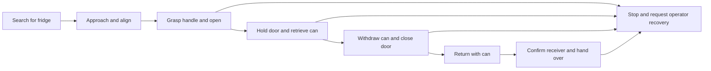

# Plan for fetching a can from a fridge

Use a task supervisor, the G1's existing locomotion controller, geometric perception, and a fine-tuned
bimanual manipulation policy. A single instruction sent to the released WLA checkpoint is not a complete
task implementation. First establish a supervised, fixed-fridge benchmark; then broaden conditions.

The first target should be: known fridge in one room, clear route, reachable shelf, one specified can,
known hinge/handle, requester at a marked return point, operator holding the remote. These are proposed
initial benchmark constraints, not claims about your room. Reverse the hand assignments if your hinge
geometry requires it: the nominal plan uses right hand for the door and left for the can.

## Phase contracts

| Phase | Controller / candidate WLA instruction | Required observations and completion condition | Stop / recovery condition |
|---|---|---|---|
| Search | Stop-and-look yaw sweep under built-in loco | Fridge detected across several fresh frames; consistent depth; save initial robot/requester location | One bounded sweep with no target: stop. No blind exploratory walk |
| Approach | Visual/depth servo, not a model angle sequence | Fridge plane and reachable manipulation base pose; velocity zero; alignment and standoff in tolerance | Stale depth/odometry, obstacle, lost target: stop and relocalize |
| Open | “Grasp the fridge handle with the right hand and open the door” | Handle pose, hinge/swing estimate, contact evidence, door angle/clearance, left arm clear | Excess load, slip, unreachable target, or door/body interference: stop with contact maintained; operator recovery |
| Retrieve | “Hold the door with the right hand and take the can with the left hand” | Door remains controlled; can 3D pose; finger closure/contact; visual can motion with hand; clear withdrawal path | Empty grasp, unstable door, failed withdrawal: stop; bounded regrasp from a known state |
| Close | “Keep the can in the left hand and close the fridge with the right hand” | Can outside swing volume; right hand push/handle plan; door plane/angle returns closed; latch remains closed after releasing contact | Door rebounds, can slips, wrist near pinch point: stop. Do not retry the full opening procedure blindly |
| Return | Validated navigation route with carried-object posture | Fridge closed; can retained; live obstacle monitoring; arrival at marked return/requester location | Localization loss, person/obstacle in route, grasp loss: stop; no odometry-only blind return |
| Handover | “Offer the can to the person” plus an independent release interlock | Robot stationary, receiving hand supports the can, sustained load transfer/contact confirmation; then open hand | Timeout or uncertain support: retain can, retract only on a verified path |

Completion must be established by observations, not by waiting one action chunk or trusting a language
instruction. A simple timer cannot tell whether a door latched or a can is in the hand. The hand bridge's
normalized position feedback alone is not a force sensor; arm tracking error alone does not prove that
the receiving person has the drink. Where force/tactile sensing is unavailable, use operator-confirmed
release during development and document the limitation.

## Stage 1: Establish the hardware and reach envelope

Measure the policy EEF frames, camera-to-body transforms, standing body height, shelf/handle heights,
door hinge/width/swing, handle shape, seal force, can size/mass, and both hands' channel directions.
Use the **23-DoF** URDF throughout. Verify that the IMU quaternion convention produces `[0,0,-1]`
projected gravity when upright and changes correctly when tilted.

Check the actual head-camera field of view at the approach and manipulation poses; the downward view
can lose the handle or shelf. Add wrist cameras if possible. Otherwise train and evaluate a head-only
policy with that omission represented explicitly; do not infer hidden can/handle locations indefinitely
from stale priors. Changing camera mounting requires new extrinsic calibration and demonstration coverage.

Resolve the existing controller's IK failures by changing base approach/door-side geometry and checking
all intermediate poses. Do not simply enlarge the 2 cm IK acceptance threshold. Your five-joint arms
cannot independently satisfy every position and orientation. If no collision-free reachable trajectory
exists for this fridge/shelf, move the can to a reachable shelf, change the handle attachment, use a
different base stance/controller, or change the robot hardware. Fine-tuning cannot add missing joints.

Exit criterion: measured FK agrees with physical hand poses; handle, door trajectory and can withdrawal
are reachable with margins; operator can teleoperate the complete sequence successfully and repeatedly.
Collect no model-driven contact trial before this.

## Stage 2: Evaluate the released model honestly

Run the public BrainCo fridge-placement and drink-pickup episodes first using `evaluate.py`, with their
native cameras and all WBT channels. Then run PC2 shadow evaluation with your views, frames and poses.
Compare native three-camera results, your camera arrangement, and a stationary-arm retargeting experiment
as separate conditions. Record whether failures are input/domain mismatch, unreachable target, timing,
grasp/contact, or task logic; these call for different fixes.

Measure warm p50/p95 inference and full sensor-to-action latency, peak shared memory, thermals, packet
loss, EEF position/orientation error, finger error, stale-chunk rejection and IK rejection. A 30-step
prediction at 30 Hz is a one-second horizon; it does not mean the model is called at 30 Hz. Choose the
execution prefix from measured latency and task dynamics. Long open-loop chunks during door contact
are especially unsuitable. The included arm gate uses a conservative 0.45 s observation age and skips
expired steps; changing that limit is not a way to make a slow system real-time.

The first physical learned evaluation should be small movements in clear space using `client.py
--execute-free-space-arms`. Its results are not the original model's WBC performance. It deliberately
has no contact manipulation mode.

## Stage 3: Collect task-specific demonstrations

Prefer short, phase-labelled demonstrations over initially teaching the entire multi-minute sequence.
Starting collection budget (an engineering estimate, not an empirically sufficient sample count):

- 50–100 successful door-open demonstrations spanning approach offsets and seal resistance.
- 50–100 bimanual can retrieval demonstrations with the right hand maintaining the door; vary can
  placement, orientation, clutter, brightness and partial occlusion.
- 50–100 door-close demonstrations while retaining the can, including near-latch/rebound states.
- 30–50 carry/offer demonstrations and explicitly labelled receiver-ready / receiver-absent cases.
- Separate recovery demonstrations from known safe states: miss/slip, partially open door, failed can
  grasp and failed latch. Do not mix uncontrolled failures into “successful” behavior cloning targets.

Hold out complete sessions and geometries, not random adjacent frames: initially 20% of sessions,
with separate final hardware trials. Save instruction, synchronized RGB, measured robot state,
commanded targets, action/control frame definitions, timestamps and intervention/success annotations.
Preserve the door-holding arm and can-holding hand in **every** bimanual sample.

`DemoWriter` and the LeRobot v3 converter in `demonstrations.py` implement stationary-arm target recording.
They do not fabricate leg commands or recover synchronized state from the old image-only logs.
[TRAINING.md](TRAINING.md) shows the teleop-loop hook and training commands. For simultaneous walking and
door pulling, collect the actual WBC observations/commands with a validated 23-DoF WBC controller;
the stationary recorder is not sufficient.

## Stage 4: Fine-tune and package

Start with frozen VLM and LoRA on the action backbone; compare a full action-head fine-tune if the
small-data baseline plateaus. Keep the new robot's camera and action profile identical between training
and inference. The 23-DoF stationary-arm profile trains the two EEF poses and two six-channel hands;
the built-in loco handles movement separately. It still needs robust state/camera conditioning.

Run a short pilot (the launcher defaults to 200 optimizer steps) to check finite loss, actual trainable
parameters, GPU memory and data decoding, then use validation curves to select duration. Use the
`MAX_TRAIN_STEPS` and `WARMUP_STEPS` environment variables for the selected full-run budget.
Training success is not just falling action loss: check held-out rollouts, target reachability, can
retention, door-contact stability and release behavior.

Use the full training checkpoint with `finalize.py`. It preserves non-LoRA trained components and merges
adapters for inference. Keep normalization and tokenizer/config alongside weights. Export/quantize only
after the PyTorch policy works; test action and closed-loop parity before attributing performance changes
to the model rather than to deployment numerics.

## Stage 5: Integrate and validate each phase

The existing `g1-fridge-fetch` tree already contains search, approach, door geometry, IK, BrainCo command,
can retrieval, closure, return and handover modules. Its tests currently fail and it has material gaps:
the return route is odometry-only, some depth-loss handling substitutes a nominal distance, contact
retries can restart from an unknown state, and handover can proceed without an affirmative visual
verification. Address these before using it as the task supervisor.

Use that state machine's phase boundaries to select the fine-tuned manipulation instruction, with a
new contact executor beneath it. The executor must:

1. Maintain high-rate stable arm/hand control independent of blocking policy inference.
2. Enforce calibrated joint/velocity/torque/contact limits and reachable bimanual targets, including
   door swing, body collision, arm-arm collision and can clearance over the complete trajectory.
3. Hold/retract according to the **contact state** on faults; opening both hands or dropping arm authority
   can drop the drink or release a spring-loaded door.
4. Check completion sensors and reject stale observations/chunks, competing command sources and loss
   of the main controller. Use bounded recovery actions with known starting states.
5. Run navigation under one controller and manipulation under one controller; do not let a WBC policy
   and the built-in loco simultaneously command the legs. A five-joint arm adaptation is not a 29-DoF WBC.

These contact-control/verification integrations are **remaining work**, not implemented by renaming
the free-space arm executor. Their thresholds depend on your measured fridge and sensor hardware.
The dataset, adaptation and evaluation code delivered here supports building them without pretending
that a missing robot controller is a checkpoint format issue.

Exit criterion: each phase passes a predeclared set of supervised hardware trials with no unexpected
contact, intervention, drop or unsupported state transition. Initially require at least 20 clean trials
per phase over the selected condition matrix; this is an engineering gate, not a safety certification.

## Stage 6: End-to-end acceptance

Run 20–30 held-out full-task trials with varied initial yaw, approach offset and can location. Log every
phase success, intervention, elapsed time, latch result, drop and final handover outcome; report numerator
and denominator. Require explicit closed-door and supported-handover evidence in the success definition.
Keep failure logs, not just demonstration videos.

For scale intuition only, seven independent phases that each succeed 95% of the time yield about
`0.95^7 ≈ 70%` end-to-end success. Real failures are correlated, so measure the actual full chain.
Broaden rooms, fridges, shelf heights, object types and requester positions only after the fixed-scene
benchmark works. Fine-tuning supplies manipulation experience; reliable task orchestration, sensing,
reachability and controller integration remain necessary.
